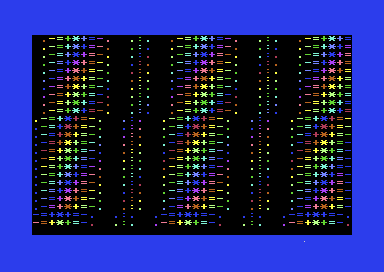

# C64 - Berlin Trip Subway Megablast

Copyright © 2026 Ulf Bertilsson. Licensed under the
[GNU General Public License v3.0 or later](LICENSE).

A Commodore 64 ACME-assembler variant of the Berlin Subway megademo engine,
centred on the Exotic Megablast effect and its synchronized music sequence.



## Contents

- `src/subway.s` — demo source
- `src/wire_cube_*.bin` — character and mask assets
- `build_release.sh` — release-oriented assembly entry point
- `V*.md`, `V*.json`, and audit files — retained version history and
  provenance

## Build

Requires [ACME](https://sourceforge.net/projects/acme-crossass/) on your PATH.

```sh
make
```

This writes `build/exotic_megablast_v45.prg`. To run it in
[VICE](https://vice-emu.sourceforge.io/):

```sh
x64sc -autostartprgmode 1 -autostart build/exotic_megablast_v45.prg
```

`build_release.sh` provides the equivalent release build. The PRG starts via
its embedded BASIC loader (`SYS 2061`).

## Live VICE capture


